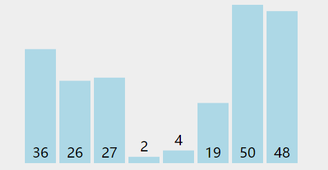

# Bubble Sort

## Description

Bubble sort is a simple sorting algorithm that works by repeatedly swapping adjacent elements in an array if they are in the wrong order. The algorithm starts at the beginning of the array and compares each pair of adjacent elements. If the elements are in the wrong order, they are swapped. This process is repeated until the entire array is sorted.

## Complexity

 <table border="0"><tbody><tr><th><strong>Time Complexity</strong></th>
				<td>&nbsp;</td>
			</tr><tr><td>Best</td>
				<td>O(n)</td>
			</tr><tr><td>Worst</td>
				<td>O(n2)</td>
			</tr><tr><td>Average</td>
				<td>O(n2)</td>
			</tr><tr><th><strong>Space Complexity</strong></th>
				<td>O(1)</td>
			</tr><tr><th><strong>Stability</strong></th>
				<td>Yes</td>
			</tr></tbody>
</table>
