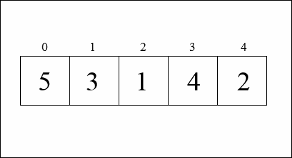

# Selection Sort

## Description

Selection sort is a simple sorting algorithm that works by repeatedly finding the minimum element from the unsorted part of an array and swapping it with the first unsorted element. The algorithm divides the input array into two parts: the sorted part and the unsorted part. Initially, the sorted part is empty and the unsorted part contains all elements. The algorithm starts by finding the minimum element in the unsorted part, swapping it with the first unsorted element, and moving the boundary of the sorted part one element to the right. This process is repeated until all elements are in the sorted part.

## Complexity

Like bubble sort, selection sort has a time complexity of O(n^2) and is not the most efficient sorting algorithm for large arrays. However, it is easy to understand and implement, making it a good choice for small arrays or educational purposes.

<table border="0"><tbody>
<tr><th><strong>Time Complexity</strong></th>
<td>&nbsp;</td>
</tr><tr><td>Best</td>
	<td>O(n2)</td>
</tr><tr><td>Worst</td>
	<td>O(n2)</td>
</tr><tr><td>Average</td>
	<td>O(n2)</td>
</tr><tr><th><strong>Space Complexity</strong></th>
	<td>O(1)</td>
</tr><tr><th><strong>Stability</strong></th>
	<td>No</td>
</tr></tbody>
</table>
