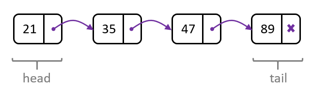

# Linked List Data Structure

## Definition

A linked list is a data structure used in computer programming to store a collection of elements, called nodes, where each node contains a value and a reference (or link) to the next node in the sequence. Unlike arrays, linked lists do not require contiguous memory locations, and the nodes can be scattered across different parts of the memory.

## Common linked list operations:

1. `length`: Returns the number of nodes in the linked list.
2. `insert`: Inserts a new node with a given value at a specified position in the linked list.
3. `delete`: Removes a node at a specified position in the linked list.
4. `get`: Returns the value of the node at a specified position in the linked list.
5. `search`: Searches the linked list for a node with a specific value and returns true if found, false otherwise.
6. `append`: Adds a new node with a given value to the end of the linked list.
7. `prepend`: Adds a new node with a given value to the beginning of the linked list.
8. `isEmpty`: Checks if the linked list is empty and returns true if it is, false otherwise.
9. `toArray`: Converts the linked list to an array, preserving the order of elements.
10. `reverse`: Reverses the order of nodes in the linked list, changing the direction of links.

Linked lists provide flexibility in adding and removing elements compared to arrays but require additional memory to store the links between nodes. They are commonly used when dynamic resizing, efficient insertion, and deletion at arbitrary positions are essential.
